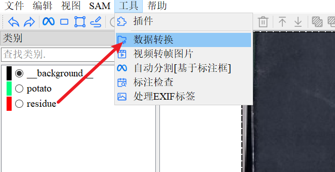
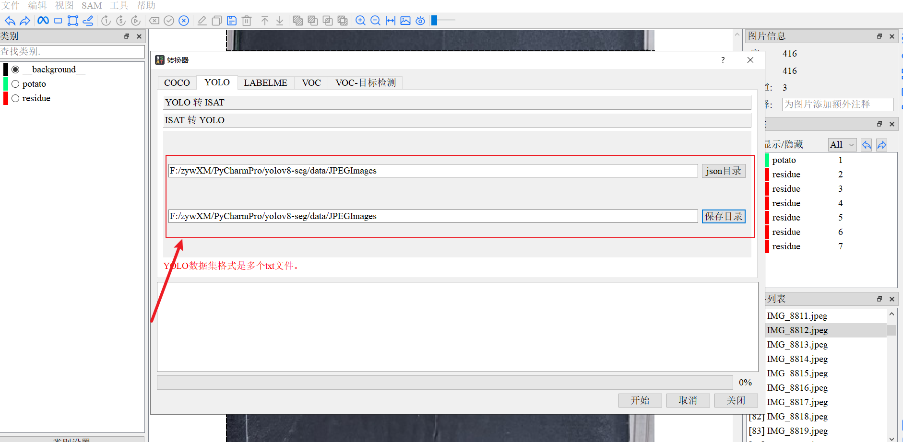

# yolov8-seg-potato（修改版）

这是对原作者 katongZL 在 Gitee 上的项目 `yolov8-seg-potato`（https://gitee.com/katongZL/yolov8-seg-potato）进行的修改与扩展后的版本。

主要改动：
- 移除了源代码中的JSON-TXT的转换，请在使用isat-sam时导出yolo格式的数据集标注；
- 重构并增强了数据集划分逻辑，支持 2-way（train/val=8:2）和 3-way（train/test/val=7:2:1）划分；
- 自动生成 YOLO 格式的 `dataset.yaml`，并支持从 `classification.txt` 读取类别顺序；
- 改进了图片扩展名适配、大小写兼容以及目录管理逻辑。

> 原始项目使用 Apache-2.0 许可；本仓库基于其代码进行修改。请在传播或再发布时保留原始许可信息并遵守 Apache-2.0 条款。

---

## 目录与数据约定

- 假设项目根目录为仓库根（本 README 所在目录）。
- `data/`：默认数据根（可在脚本顶部修改）。
	- `data/<dataset>/img/`：放图片（支持 `.jpg/.jpeg/.png/.bmp/.tif/.webp` 大小写扩展名）。
	- `data/<dataset>/label/`：放标注文件（YOLO `.txt`，或 ISAT/Labelme 导出的 `.json`（需先转换））。
	- `data/<dataset>/label/classification.txt`：类别文件，每行一个类别，脚本会按此顺序生成 `names`。

脚本输出：
- `data/<dataset>/dataset/`：划分后数据集根目录，包含：
    - `images/train`、`images/val`、`images/test`（如启用 test）
    - `labels/train`、`labels/val`、`labels/test`（如启用 test）
    - `dataset.yaml`（自动生成，供 YOLOv8 训练使用）

---

## 为什么需要标签转换？（简要说明）

标注工具（如 ISAT、Labelme）通常以 JSON/实例分割格式保存标注，包含 `objects`、`segmentation`、`bbox` 等字段；这些格式结构多样，不一定直接符合 YOLO/YOLO-seg 所需的文本格式。YOLO 训练通常需要：

- 对于检测：每张图的 `.txt` 文件包含若干行 `class_id x_center y_center w h`（归一化）；
- 对于分割（YOLO-seg）：`.txt` 也可以包含 `class_id` 后跟多边形点的归一化坐标序列。

因此需要把 JSON（复杂嵌套格式）统一解析并写成 YOLO 所需的 `.txt`，才能用于训练或进一步划分。

本代码仅对TXT格式进行优化，关于JSON格式的数据，建议使用原标注工具进行转换。

---

## 推荐流程（一步步）

1. 标注

- 使用 `isat-sam` 或其它标注工具完成分割标注；示例：

```bash
# 创建并激活 conda 环境（可选）
conda create -n dataset python=3.8
conda activate dataset

# 安装 isat-sam（如果使用）
pip install isat-sam

# 运行标注工具并完成标注
isat-sam
```

- 标注完成后，导出yolo格式数据集



2. 准备数据：
- 把图片放到 `data/<dataset>/img/`。
- 把标注（YOLO `.txt`）放到 `data/<dataset>/label/`，并确保 `classification.txt` 存在（每行一个类别）。

3. 运行脚本进行转换/检查/划分

```bash
python 01_convert_labelme_to_yolo_seg.py
```

脚本会：
- 询问是否生成 `test` 集合（默认回车/是 → 3-way 划分 7:2:1；输入 `n` → 2-way 划分 8:2）。
- 按选择的划分规则随机划分并复制图片与 `.txt` 到 `data/<dataset>/dataset/` 中。
- 生成 `dataset.yaml`，其中 `names` 来自 `classification.txt`。

4. 使用 `dataset.yaml` 训练 YOLOv8

```bash
# 假设你已经安装并配置了 YOLOv8
# 例如使用 ultralytics 的 yolov8:
#   pip install ultralytics

yolo detect train data=data/<dataset>/dataset/dataset.yaml model=yolov8s-seg.pt epochs=100
```

---

## 常见问题与注意事项

- 如果脚本提示缺少某些 `.txt`，说明对应图片没有正确的 YOLO 标注，你可以：
    - 使用其他脚本或原始的标注工具把 JSON 转为 YOLO 格式；
- 确保 `classification.txt` 的类别顺序和标注文件中使用的类别一致；否则部分标注会被跳过或类别 id 对不上。
- 如果你的图片扩展名是大写（例如 `.JPG`），脚本会尝试匹配不同大小写的扩展名，但建议统一为小写以减少问题。

---

## 许可与致谢

- 原始代码来源：katongZL 的 Gitee 仓库：https://gitee.com/katongZL/yolov8-seg-potato ，采用 Apache-2.0 许可；本仓库基于其代码修改并继续沿用该许可约束，请在分发时保留原始许可声明。
- 参考/学习文章： https://blog.csdn.net/m0_62681080/article/details/155195403

